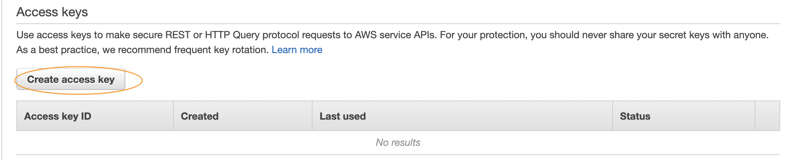

### Synthetic Data Generation [OPTIONAL]
In a nutshell, you need to-
- Install **Java** and clone the [Git repo](https://github.com/synthetichealth/synthea.git) 
- Verify the installation 
- Update **src/main/resources/synthea.properties** file to generate files in csv format. Ensure that the property exporter.csv.export is set to true (exporter.csv.export = true)
- Run the tool to generate data set (For example, ./run_synthea -p 10000). The latest command can be found on this [page](https://github.com/synthetichealth/synthea/blob/master/README.md)

This will generate the data set in **“output/csv”** directory of the cloned directory structure. Some of the files generated by the tool are *imaging_studies.csv, allergies.csv, payer_transitions.csv, patients.csv, encounters.csv, conditions.csv, medications.csv, careplans.csv, observations.csv, procedures.csv, immunizations.csv, organizations.csv, providers.csv and payers.csv*. These files contain standard [EHR](https://www.cms.gov/Medicare/E-Health/EHealthRecords) data. To understand the data dictionary of the generated data set, you can refer [here](https://github.com/synthetichealth/synthea/wiki/CSV-File-Data-Dictionary).

- After the stack is successfully created. Get **ACCESS_KEY** and **SECRET_KEY** for the created IAM user **s3upload**. [Click on this link to open the console](https://console.aws.amazon.com/iam/home?#/users/s3upload). You can follow the instructions [here](https://docs.aws.amazon.com/IAM/latest/UserGuide/id_credentials_access-keys.html#Using_CreateAccessKey) to create `ACCESS_KEY` and `SECRET_KEY` for the user. Once created, download the credentials. Screenshots below can also guide you through the process of creating credentails. This IAM user is required to upload the raw data to required S3 bucket.

- Download [upload data script](upload_data.sh) to your local system that can be used to upload the generated data to S3 bucket. Copy this script to **“output/csv”** directory  of synthetic data generation tool. You need to then update the script as - **ACCESS_KEY** and **SECRET_KEY** from the downloaded credentials file  and **KMS KeyId** and **S3 Bucket name** from CloudFormation output. 

- Run the upload data script `./upload_data.sh` after updating the values. This script will upload all the generates CSV files to S3 bucket.
